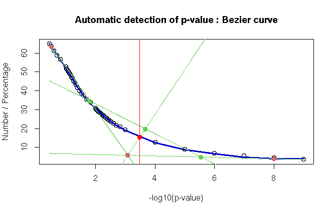
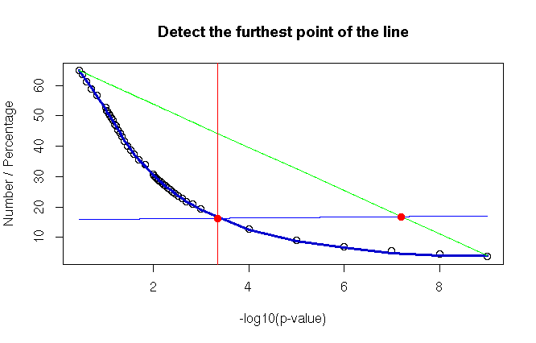

<h1 align="center"><i>PV</i>aluator</h1>


&nbsp;


## Presentation
The PValuator is an R package that automatically determines the optimal p-value using mathematical methods.

The methods (Euclidean distance, geometry of Bézier curves) aim to determine the area where the curvature of the curve, representing the number of elements obtained as a function of the p-value, is most pronounced.

**R version ⩾ 4.2.1** is recommended.

&nbsp;


## Installation
### Linux / macOS installation
Open a terminal and use these commands :

```
git clone https://github.com/AlexandreBoulle/PValuator.git
tar -czvf PValuator.tar.gz ./PValuator/
```

Open a R console or RStudio and use this command :

```
install.packages("/your_path/PValuator.tar.gz", repo = NULL, type = "source")
```

### Windows installation

* Click on the green "Code" button (top right) and choose "Download ZIP"
* Uncompress the folder and then compress it to ".tar.gz" using 7-Zip or another tool (compress to ".tar" and then compress ".tar" folder to ".gz")
* Open a R console or RStudio and use this command :

```
install.packages("/your_path/PValuator-main.tar.gz", repo = NULL, type = "source")
```


&nbsp;


## Package using

* Load the package : 

```
library(PValuator)
```

* Prepare a dataframe (df) containing two columns (value of each p-value and the associated number of occurrences / percentage)
* **NOTE** : if you have a table containing elements (e.g. genomic regions) associated with a p-value so you can prepare a dataframe usable by the package :

```
prepare_data(data, column, nbr.pv = 20)
```

* To obtain more informations about parameters used in this function (or other R functions), you can run this R command :

```
?prepare_data
```
  

### Method 1 : Bézier curves

* Display the graphical result for the method using the geometric properties of Bézier curves :

```
bezier_plot(df, cv = "no", sp = 0.5, fraction.var = 5e-3, main.title = "Automatic detection of p-value : Bezier curve", x.title = "-log10(p-value)", y.title = "Number / Percentage")
```

* Show the determined p-value :

```
bezier_pvalue(df, cv = "no", sp = 0.5, fraction.var = 5e-3)
```

* Example :

<div align="center"></div>


### Method 2 : Euclidean distance

* Display the graphical result for the method calculating the Euclidean distance between a line and the curve :

```
euclidist_plot(df, cv = "no", sp = 0.5, fraction.var = 5e-3, main.title = "Detect the furthest point of the line", x.title = "-log10(p-value)", y.title = "Number / Percentage")
```

* Show the determined p-value :

```
euclidist_pvalue(df, cv = "no", sp = 0.5, fraction.var = 5e-3)
```

* Example :

<div align="center"></div>


&nbsp;

&nbsp;


<div align="center"></div>
